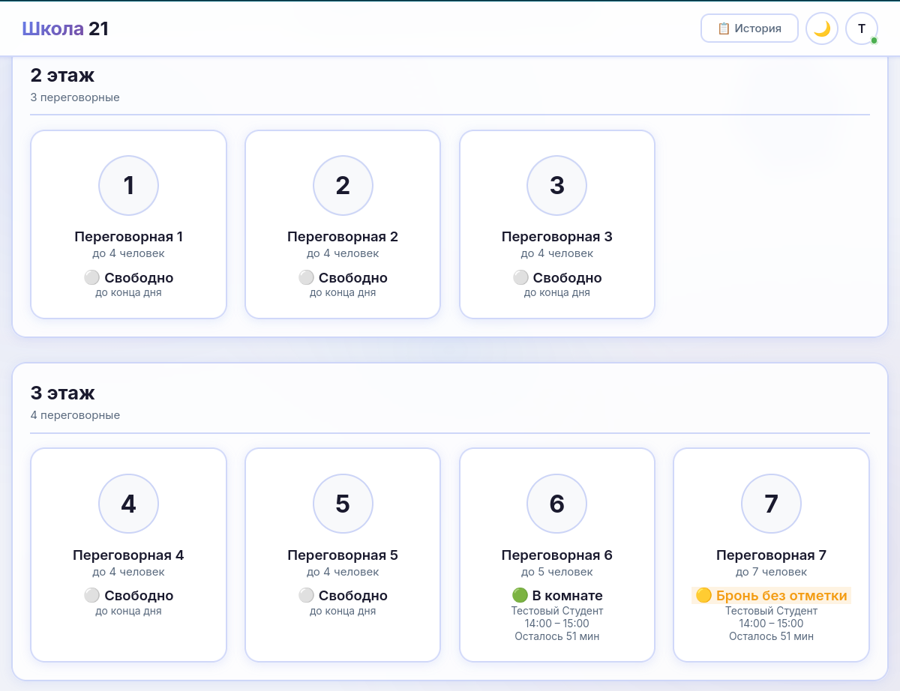
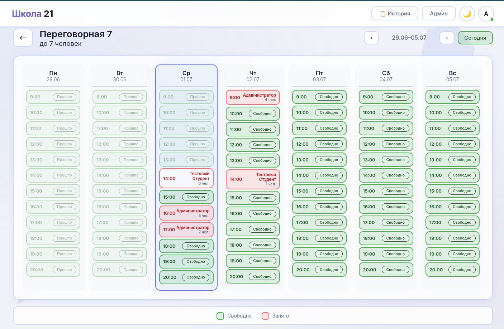
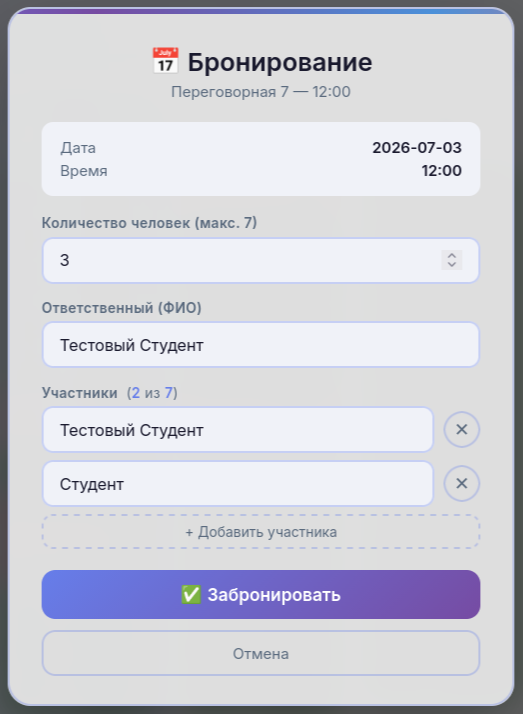
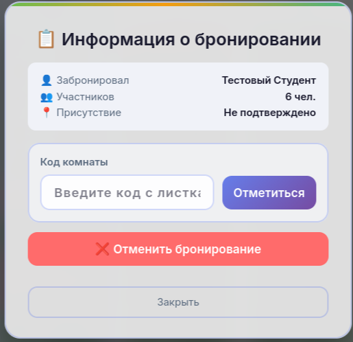

# Meeting Room Management System

A web application for booking and managing meeting rooms in office and coworking spaces.

This project was developed as part of a university summer internship by a student team. Unlike a traditional booking calendar, the system is designed as the foundation of a workspace management platform that connects the **digital footprint** (calendar bookings) with the **physical state** of meeting rooms (actual room occupancy).

---

## ✨ Features

* User registration and authentication
* Weekly meeting room booking calendar
* Booking creation and validation
* Current room occupancy page
* Administrator dashboard
* Booking statistics and analytics
* Dark and light themes
* Responsive web interface
* REST API based architecture

---

## 🖼 Screenshots






---

## 🏗 Architecture

```
                Web Browser
                     │
                     ▼
          HTML + CSS + JavaScript
                     │
          REST API (JSON over HTTP)
                     │
                     ▼
               Flask Backend
                     │
              SQLAlchemy ORM
                     │
                     ▼
               MySQL Database
```

---

## 🚀 Installation

### 1. Clone the repository

```bash
git clone https://github.com/codyfine/meeting-room-booking.git
cd meeting-room-booking
```

### 2. Install Python dependencies

```bash
pip install -r requirements.txt
```

### 3. Create the MySQL database

Run the SQL script:

```
database/db_create.sql
```

The script automatically:

* removes the previous database (if it exists);
* creates a new database;
* creates all required tables;
* initializes the database schema.

### 4. Configure database connection

Open `app.py` and set your MySQL connection parameters if necessary.

### 5. Start the application

```bash
python app.py
```

The application will be available at

```
http://localhost:5000
```

---

## 💡 Future Development

Possible future improvements include:

* QR code Check-in
* NFC authentication
* Bluetooth Beacon integration
* Motion sensors
* Computer vision for occupancy detection
* Google Calendar synchronization
* Microsoft Outlook integration
* Telegram Bot notifications
* Mobile application

---

## 👥 Team

Developed by a student team during a university summer internship.

---

## 📄 License

This project is licensed under the MIT License.
